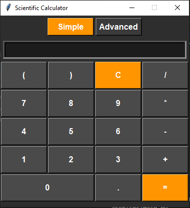

# Scientific Calculator - Learning Project 🧮

**A Python/Tkinter calculator project by Me - [iamAbdo](https://github.com/iamAbdo)**  
*Feel free to use, modify, and distribute this code for any purpose!*
*note that this code has many issues though*



## About This Project
This is a learning project developed to practice Python programming and GUI development. Created to understand:

- Tkinter widget management
- Object-oriented programming patterns
- Application state management
- Modular code organization

## Technologies Used 🛠️
### Core Stack:
- **Python 3** - Base programming language
- **Tkinter** - Standard GUI toolkit
- **Math Module** - Scientific calculations

### Key Features:
- Dual Interface Modes (Simple/Advanced)
- Real-time Expression Evaluation

## Getting Started
### Prerequisites
- Python 3.8+ [Download Python](https://www.python.org/downloads/)
- Tkinter (included with Python)

### Installation
```bash
git clone https://github.com/iamAbdo/PythonCalculator.git
cd PythonCalculato
```

### Running
```bash
python src/main.py
```

## Code Usage Rights
This project is open for anyone to do what ever
*Attribution appreciated but not required*

## Future Plans
- [ ] Create Windows/Mac executable
- [ ] Add unit tests
- [ ] Implement keyboard shortcuts
- [ ] Add calculation history
- [ ] Support theme switching

## Project Structure
```
calculator-app/
├── src/
│   ├── main.py
│   ├── app.py
│   ├── widgets/
│   ├── utils/
│   └── config/
└── requirements.txt
```

## How to Contribute
1. Fork the repository
2. Create feature branch (`git checkout -b feature/feature-name`)
3. Commit changes (`git commit -m 'Add feature'`)
4. Push branch (`git push origin feature/feature-name`)
5. Open Pull Request

## Learning Resources
- [Tkinter Documentation](https://docs.python.org/3/library/tkinter.html)
- [Python Math Module](https://docs.python.org/3/library/math.html)
- [GUI Development Guide](https://realpython.com/python-gui-tkinter/)
